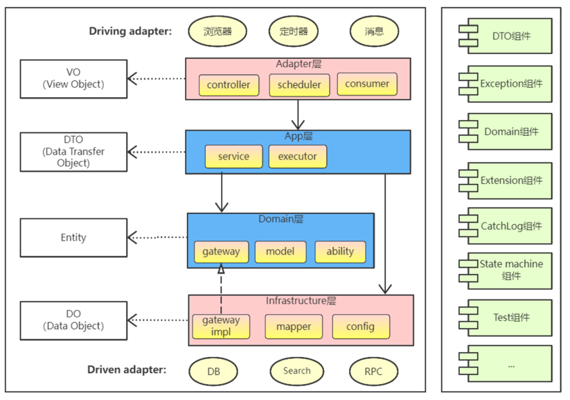

# java 代码规范
## 项目结构
```
/project-root
  /src
    /main
      /java
        /com
          /example
            /demo
              DemoApplication.java      // spring boot 启动入口
              /config                   // 配置信息
                DemoConfig.java
              /controller               // 存放控制器类
                StudentController.java
              /service                  // 存放服务类
                StudentService.java
              /mapper                   // 存放数据访问接口
                StudentMapper.java
              /entity                   // 存放数据表对象
                StudentDO.java
              /model                    // 存放数据模型类
                Student.java
              /vo                       // 存放展示对象
                StudentVO.java
              /utils                    // 存放工具类
                DemoUtil.java
              /enums                    // 存放枚举类
                DemoEnum.java
      /resources
        application.properties

  /test                                 // 存放测试代码
    /java
      /com
        /example
          /controller
            SampleControllerTest.java
          /service
            SampleServiceTest.java
  /target                               // 构建输出目录
  README.md                             // 项目的说明文档
  .gitignore                            // Git忽略文件配置
  pom.xml                               // Maven项目配置文件
```
[demo](./demo)

如果是小型创业项目, 我们建议使用demo中的单体应用甚至serverless、lambda. 如果是大型java项目,我们建议下图中的cola架构(alibaba)



### 基准
- 分层架构,如上图,上层依赖下层,下层对上层屏蔽处理细节,每一层各司其职,分离关注点
- 如无必要勿增实体. 领域模型对设计能力要求很高,没把握用好,一个错误的抽象还不如不抽象
- 线上应用不要依赖 SNAPSHOT 版本
- 依赖于一个二方库群时,必须定义一个统一的版本变量,避免版本号不一致
- 同一个项目中代码风格保持一致
- 系统设计时,根据依赖倒置原则,尽量依赖抽象类与接口,有利于扩展与维护

## 通用三方库
- 应用开发框架: spring boot
- 定时任务: quartz、elastic job、spring task scheduling
- 日志: log4j、logback、log4j2
- 测试: junit、testng、mockito、spring test
- arweave sdk: arseedingsdk4j-sdk
- ethereum sdk: web3j
- json: jackson、gson、fastjson
- 数据源: druid、c3p0
- http: OkHttp、Apache HttpClient
- redis: jedis、redisson
- 配置: zookeeper、nacos、apollo
- MQ: rocketMQ、kafka
- RPC: dubbo、spring cloud

## 日志
应用中不可直接使用日志系统（Log4j、Logback）中的 API，而应依赖使用日志框架 SLF4J 中的 API，使用门面模式的日志框架，有利于维护和各个类的日志处理方式统一

```agsl
import org.slf4j.Logger;
import org.slf4j.LoggerFactory;
private static final Logger logger = LoggerFactory.getLogger(Test.class); 
```

### 使用
```agsl
private static final Logger logger = LoggerFactory.getLogger(Test.class); 

// debug level
logger.debug("Processing trade with id: {} and symbol: {}", id, symbol);

// info level
logger.info("Processing trade with id: {} and symbol: {}", id, symbol);

// warn level
logger.warn("Processing trade with id: {} and symbol: {}", id, symbol);

// error level
logger.error(msg + "_" + e.getMessage(), e);
```

### 使用规范
* 所有日志文件至少保存 15 天，因为有些异常具备以“周”为频次发生的特点
* 对于 trace/debug 级别的日志输出,必须进行日志级别的开关判断
```agsl
if (logger.isDebugEnabled()) { 
    logger.debug("Current ID is: {} and name is: {}", id, getName());
}
```
* 避免重复打印日志，浪费磁盘空间
* 异常信息应该包括两类信息: 案发现场信息和异常堆栈信息
* 生产环境禁止输出 debug 日志; 有选择地输出 info 日志
* 可以使用 warn 日志级别来记录用户输入参数错误的情况,避免用户投诉时,无所适从
* 尽量用英文来描述日志错误信息

#### 正确使用日志级别
在java中,常见的日志级别由低到高分别是trace、debug、info、warn、error和fatal
1. trace: 最低级别的日志,用于追踪程序的执行过程. 一般情况下,只在调试阶段使用,用于输出一些详细的调试信息.

2. debug: 用于输出调试信息,帮助开发人员定位问题. 在生产环境中,一般不建议使用debug级别,因为会产生大量的日志输出.

3. info: 用于输出一些重要的运行信息,如程序启动信息,关键操作的结果等. info级别的日志通常在生产环境中使用,用于监控程序的运行状态.

4. warn: 用于输出一些警告信息,表示程序可能存在潜在的问题,但不会影响程序的正常运行. 比如,某个方法的参数不符合预期,但程序仍然可以继续执行.

5. error: 用于输出错误信息,表示程序发生了可恢复的错误. 当程序出现错误时.一般会记录error级别的日志,并进行相应的处理.

6. fatal: 最高级别的日志,用于输出致命错误信息. 当程序发生无法恢复的错误时,会记录fatal级别的日志,并终止程序的执行.

在实际应用中，可以根据具体需求设置日志级别。通常情况下，开发环境可以设置为debug级别，生产环境可以设置为info级别,以避免产生过多的日志输出

## 编码规范
参考 [阿里巴巴java开发规范](https://github.com/alibaba/Alibaba-Java-Coding-Guidelines)

阿里巴巴java开发规范写的非常详细,这里写一些日常开发经常碰到的情况

### 命名风格
- 代码中的命名均不能以下划线或美元符号开始，也不能以下划线或美元符号结束
- 代码中的命名严禁使用拼音与英文混合的方式，更不允许直接使用中文的方式
- 类名使用UpperCamelCase风格，但以下情形例外：DO / BO / DTO / VO / AO / PO等
- 方法名、参数名、成员变量、局部变量都统一使用lowerCamelCase风格，必须遵从驼峰形式
- 常量命名全部大写，单词间用下划线隔开，力求语义表达完整清楚，不要嫌名字长
- 抽象类命名使用Abstract或Base开头；异常类命名使用Exception结尾；测试类命名以它要测试的类名开始，以Test结尾
- 包名统一使用小写，点分隔符之间有且仅有一个自然语义的英语单词。包名统一使用单数形式，但是类名如果有复数含义，类名可以使用复数形式

### 安全规约
- 隶属于用户个人的页面或者功能必须进行权限控制校验
- 用户敏感数据禁止直接展示，必须对展示数据进行脱敏
- 用户输入的 SQL 参数严格使用参数绑定或者 METADATA 字段值限定，防止 SQL 注入
- 用户请求传入的任何参数必须做有效性验证

### 数据库设计
- 表名字段名必须使用小写字符或数字；禁止出现数字开头，禁止两个下划线之间只有数字
- 禁用保留字，如desc、range、match、delayed等
- 主键索引名为 pk_字段名；唯一索引名为 uk_字段名；普通索引名则为 idx_字段名
- 小数类型为decimal，禁止使用float和double
- varchar为变长字符串，长度不要超过5000，如果存储长度超过该值，使用text，并独立表出来
- 表必备三字段：id, create_time, update_time
- 不要使用count(列名)或count(常量)来替代count(*)，count(*)是SQL92定义的标 准统计行数的语法，跟数据库无关，跟NULL和非 NULL无关
- 当某一列的值全是NULL时，count(col)的返回结果为0，但 sum(col)的返回结果为 NULL，因此使用sum()时需注意NPE问题
- in操作能避免则避免，若实在避免不了，需要仔细评估 in后边的集合元素数量，控制在1000个之内